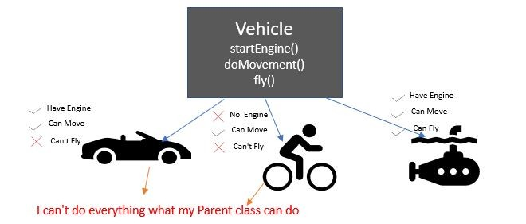

Design Principles
Here are some common design principles that are often followed in Flutter development:

* Material Design: A design system developed by Google that provides a consistent look and feel across all platforms and devices.
* Responsiveness: Designing the user interface to work seamlessly on different screen sizes and aspect ratios.
* User-centered Design: Designing the application with the user’s needs and goals in mind.
* Simplicity: Designing the user interface to be simple and intuitive, minimizing the number of steps needed to complete a task.
* Consistency: Maintaining a consistent look and feel throughout the application, using consistent colors, typography, and layout.
* Accessibility: Making the application usable by people with disabilities, including screen reader support, keyboard accessibility, and high-contrast mode.
* Performance: Designing the application to be fast and responsive, even on low-end devices.
* 
By following these design principles, you can create a user-friendly and visually appealing application that provides a great user experience.

---

Flutter, with its focus on beautiful and performant UIs, heavily emphasizes design principles in its development process. Here's how design principles are applied in Flutter:

**Material Design Principles:**

* Flutter adheres to Google's Material Design guidelines, which provide a comprehensive set of principles for creating UIs that are consistent, beautiful, and user-friendly across different platforms (Android, iOS, Web, etc.).
* Material Design principles encompass concepts like hierarchy, visual depth, bold colors, responsive motion, and thoughtful use of white space.

**Key Considerations for Flutter Apps:**

* **Leveraging Widgets:** Flutter's rich set of widgets is designed to implement Material Design principles. By using widgets like `AppBar`, `Text`, `Card`, and `ElevatedButton`, you can automatically benefit from built-in styling and behaviors that follow Material Design guidelines.
* **Customizing Widgets:** While widgets provide a foundation, you can customize them using properties and themes to achieve your desired look and feel while staying within the Material Design framework.
* **Understanding Layout:** Flutter offers various layout widgets like `Row`, `Column`, `Stack`, and `Padding` to structure your UI elements. Understanding these widgets and their properties is essential for creating layouts that follow principles like balance, alignment, and white space utilization.
* **Theming:** Flutter's theming system allows you to define global styles for your app, including colors, fonts, text styles, and button styles. This promotes consistency and makes it easier to maintain a unified design throughout your app.
* **State Management:** Effective state management (e.g., with Provider or BLoC) ensures that your UI updates dynamically based on user interaction and data changes, adhering to the principle of providing clear feedback to users.
* **Accessibility:** Flutter supports building accessible UIs that cater to users with disabilities. This aligns with the design principle of inclusivity and ensures your app can be used by everyone.

**Benefits of Following Design Principles in Flutter:**

* **Faster Development:** Utilizing Material Design principles and pre-built widgets streamlines the development process, allowing you to focus on app functionality and logic.
* **Consistent UIs:** Following design principles leads to consistent UIs across different screens and platforms, improving user experience and brand recognition.
* **Intuitive Interactions:** Material Design emphasizes familiar UI patterns and behaviors, making your app intuitive and easy to learn for users.
* **Beautiful Apps:** By adhering to design principles, you can create visually appealing and engaging UIs that enhance the overall user experience.

**Additional Tips:**

* Refer to the official Material Design guidelines: [https://m3.material.io/](https://m3.material.io/)
* Explore Flutter's widget documentation to understand their properties and how they align with design principles: [https://docs.flutter.dev/ui/widgets](https://docs.flutter.dev/ui/widgets)
* Utilize code samples and tutorials to see design principles implemented in practice.

By effectively following design principles and leveraging Flutter's capabilities, you can create beautiful, user-friendly, and accessible applications that provide a delightful user experience.

---

https://kerteriz.net/yazilim-tasarim-ilkeleri-software-design-principles-nedir/
1. **SOLID** 
    1. **SRP – Single Responsibility Principle** = `Bir sınıfın değişmesi için tek bir nedeni olmalıdır veya bir sınıf her zaman tek bir işlevi yerine getirmelidir.SRP.`
    Her sınıfı, yazılımın sağladığı işlevselliğin tek bir bölümünden sorumlu kılmaya çalışın ve bu sorumluluğu tamamen sınıf tarafından encapsulate edilmiş (içerisinde gizli de diyebilirsiniz) yapın. Programın belirli yönlerine teker teker odaklanmanın zorlaştığını düşünüyorsanız, tek sorumluluk ilkesini hatırlayın ve bazı sınıfları bölümlere ayırmanın zamanının gelip gelmediğini kontrol edin.
    2. **OCP – Open-Closed Principle** = `Sınıflar ve methodlar genişletmek için açık olmalı, ancak düzenleme için kapalı olmalıdır.OCP.`
    Bir sınıf zaten geliştirilmiş, test edilmiş, gözden geçirilmiş ve bir framework’e dahil edilmişse veya bir uygulamada başka bir şekilde kullanılıyorsa, kodunu bozmaya çalışmak risklidir. Sınıfın kodunu doğrudan değiştirmek yerine, bir alt sınıf oluşturabilir ve orjinal sınıfın farklı davranmasını istediğiniz kısımlarını geçersiz kılabilirsiniz. Hedefinize ulaşacaksınız ama aynı zamanda orijinal sınıfın mevcut istemcilerini de bozmayacaksınız.
    3. **LSP – Liskov Substitution Principle** = `Bir sınıfı genişletirken, istemci kodunu bozmadan üst sınıfın nesneleri yerine alt sınıfın nesnelerini geçirebilmeniz gerektiğini unutmayın.LSP.`

---
https://www.youtube.com/watch?v=Vgpqts9qkhE&list=PLQVXoXFVVtp2eAq33DVNxeoXLXj4VMYpT
https://www.youtube.com/watch?v=A5Q5F7lCquQ&pp=ygUQc29saWQgaW4gZmx1dHRlcg%3D%3D

* `Loose Coupling​ Prensibi` = bağımlılıkların olmadığı bir program yazmak değil, olabilidiğince bu bağımlılıkların yönetilebilir kılmaktır. Bağımlılıkları yönetmek için interface veya abstract class kullanılmalıdır.
* Sınıflar oluşturulmadan önce abstract sınıfı veya interface si oluşturulur.
* Interfaceler sınıflarımız için contructer mantığında çalışır. Sınıflar için sözleşmeler diyebiliriz. Çünkü interface içerisindeki her yapı implemente edilen yapılar tarafınca uygulanmaları zorunludur.
* Prensipler iç içedirler.

**SOLID** 
1. `SRP - Single Responsibility​ Principle` = Bir sınıfı veya metodu mümkün mertebe tek bir sorumluluğa odaklı inşa edilmesi gerektiğini ilke olarak savunan bir prensiptir. Bir sınıfın veya metodun değişmesi için yalnızca tek bir nedeni olması gerekir.

2. `OCP - Open/Closed Principle` = Bir sınıfın gereksinimler doğrultusunda değiştirilmeye gerek duyulmaksızın genişletilebilir bir şekilde tasarlanmasını savunan prensiptir. Sisteme yeni gereksinimlerden dolayı dahil olması gereken yeni davranışlar ilgili arayüz sayesinde entegre edilebilir olmaktadır. Değiştirilmeye kapalı, genişletilmeye açık olmaktır.

3. `LSP - Liskov Substitution Principle`= Ortak referanstan türeyen nesneler herhangi bir davranış değişikliğine gerek duymaksızın birbirlerinin yerlerine geçebilmelidir. Bunu da tek sınıf üstünde birden çok abstract class veya interface kullanarak yapabiliriz.

4. `ISP - Interface Segregation Principle` = Yazılımdaki davranışları tek bir bütün olarak tutmaktansa, birbirlerinden bağımsız olacak şekilde birden çok parçaya bölmek ideal kod yapısını ortaya çıkarır. Sınıflara ihtiyaç duymadıkları imzaları arayüzlerle zorlayarak işlevsiz metotlar eklemek ISP'i ihlal etmek demektir. Hacmi geniş alan ve davranışsal olarak farklı yetenkleri içerisinde barındıran interface'ler mümkün mertebe yeteneklerine göre parçalanarak küçültülmelidirler.

* ISP ihlali, doğrudan LSP ve SRP'ın ihlaline sebebiyet vermektedir.
* ISP, sınıf tarafından desteklenmeyecek metotların lüzumsuz yere tanımlanmamasına karşı odaklanırken, LSP ise benzer şekilde bu tarz işlevsiz metotların barındırıldığı sınıflardan olan nesnelerin kendi aralarında olan değişimleri sürecinde patlama ya da boşa çıkma riskini ortadan kaldırmaya odaklanmaktadır.
* SRP'da ise sınıfların değişmesi için yalnızca tek bir nedenin olması gerektiği söylenirken, ISP'de de hacmi büyük arayüzler yüzünden implemente edilmiş alakasız yöntemlerin değiştirilmesi gibi durumlarda ilgili sınıfta değişiklik gerekeceğinden, dolaylı yoldan sınıfların sadece tek bir değişim nedeni olması desteklenmektedir. 

5. `DIP - Dependency Inversion Principle` = Yazılımda gidişat tek bir davranışa bağımlı olmamalı, bilakis davranışlar sizin kararınıza bağımlı olmalı. Dependency inversion prensibi, bir sınıfın concrete/somut sınıflara değil onların abstraction'larına bağlı olması gerektiğini önerir. Böylece o sınıf herhangi bir somut sınıfa bağımlı olmayacak, tam tersi somut sınıf(lar) ilgili sınıfa bağımlılık sergiliyor olacaktır. Böylece hiçbir sınıf concrete/somut yapılanmakara değil onların abstraction'larına/soyut yapılarına güvenecektirler. DIP: sınıflar arasındaki bağımlılığı soyutlamakta, uygulamanın ihtiyaca göre davranış değişikliğine istikrar getirmekte ve sistem açısından sürdürülebilirlik ve ölçeklenebilirlik sağlamaktadır. 
!!