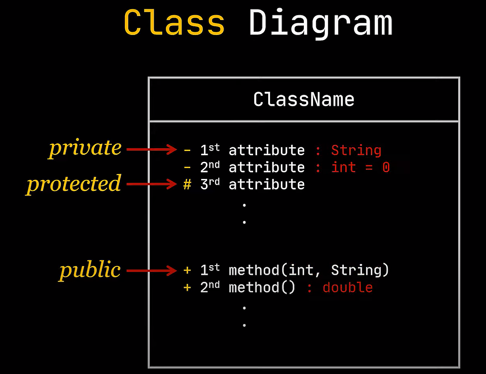
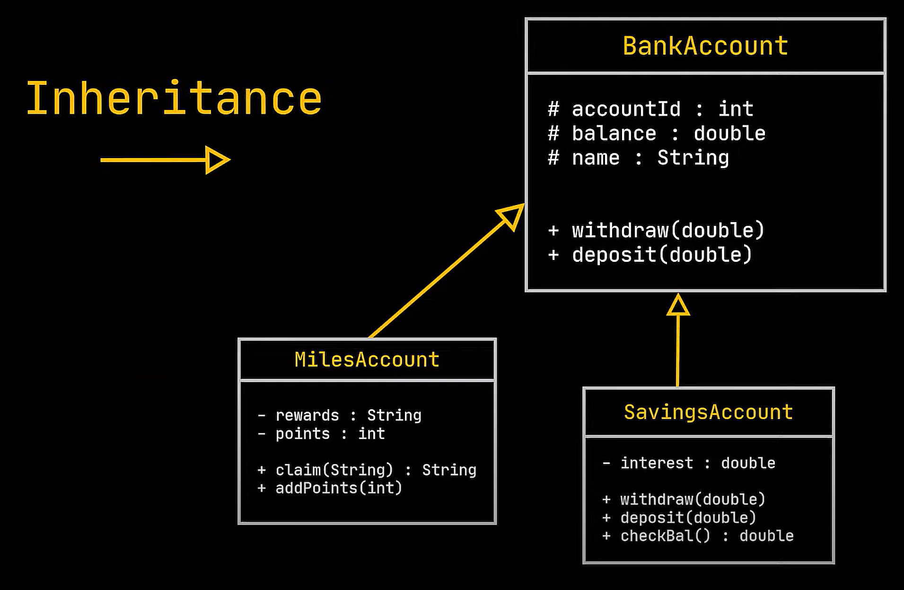
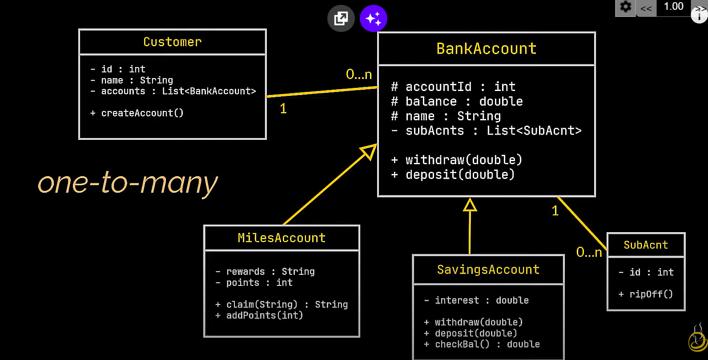
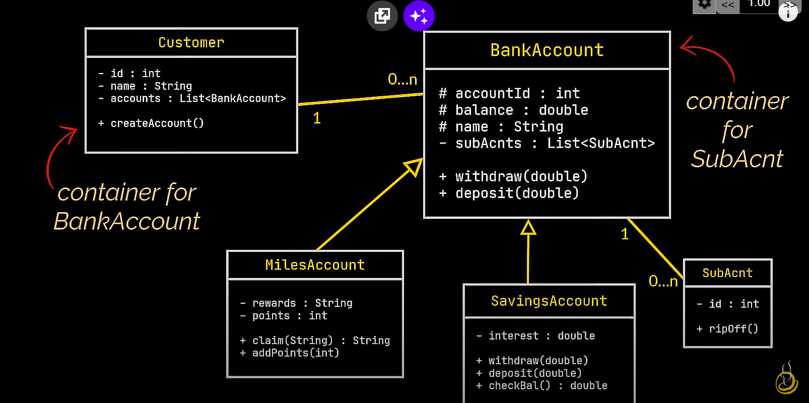
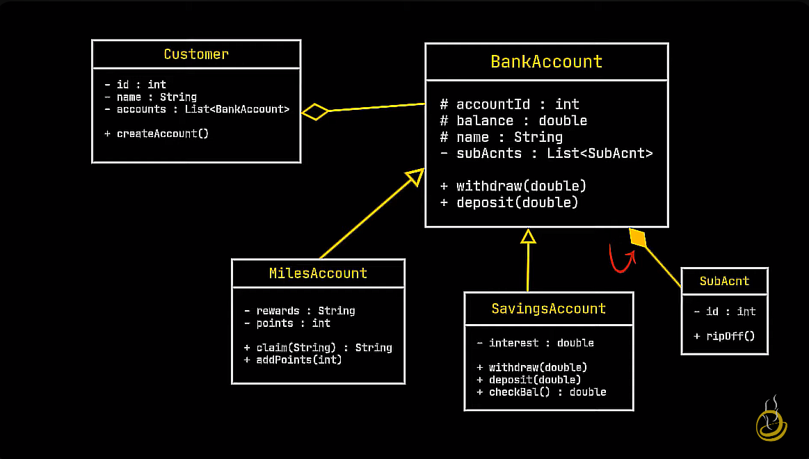
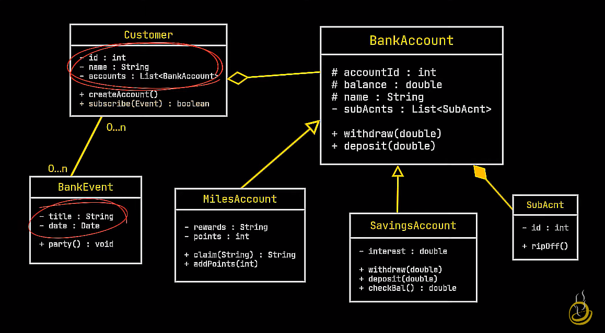
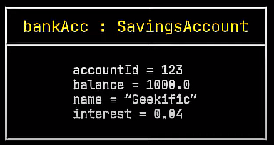
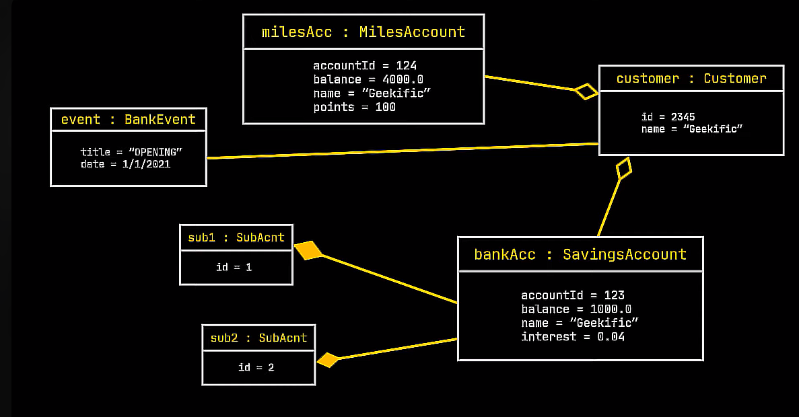

https://www.youtube.com/watch?v=sN2_CoB_kbw
* `UML` is not a programming language but a graphical notation and used to draw diagrams of an object-oriented system.
* Mainly there are two diagrams. Object diagrams and Class diagrams.

# Class Diagram
* `Class diagram` is main building block of any object-oriented solution.
* Class diagram is graphical representation of the classes in our system and the relationships they share.
* Each class representation has three sections:
  * The name of the class at the top
  * The attributes in the middle 
  * The behaviors or methods at the bottom
* Sign before the fields:
  * `+` sign indicates that this field is public
  * `-` sign indicates that this field is private
  * `#` sign indicates that this field is protected
* Inside a set of parentheses next to the method name we can specify the type of the argument of the method
* After a colon we can specify the type of the returned variables by this method along with some default values.

* The relationship between  these classes is obviously inheritance, and it is specified in a class diagram using this arrow.: 

# Association

* A customer can have `multiple bank accounts` but a specific bank account `can only belong to one customer`, same applies to the sub-account class, a specific  sub-account `can only belong to one bank account`, but any given bank account `can have  multiple sub-accounts`, this is referred to as `one-to-many` relationship, you may also be aware of the many-to-many or the one-to-one relationships, these define an `association`  between our objects, and in a UML diagram an association is represented with the arrow you can see in front of you.

# Aggregation

*  However in our case the customer class is kind of a `container` for the  bank account class which is called the `contained` in this case, and the BankAccount class is also a `container` but for the SubAcnt class which in this case is the `contained`, this is referred to as a `has-a relationship or a directional association`, also known as an `aggregation`, which in our case is what we have in both cases, we can say that the customer has-a or several bank accounts, or  the bank account has-a or several sub-accounts. `So let's replace these association arrows with aggregation arrows` in our class diagram.

# Composition

* If we `delete` our Customer class, the BankAccount class can `still be used` by our system, it will in some way still be useful, in this video we even created it before we created the customer class, 
* but what about the sub-account class? can we say  the same about it? can the sub-account class exist without the BankAccount class? If we delete all bank account classes from our application the customer class may still be useful in some  way to the application, but this SubAcnt class what are we gonna do with it? `Well nothing`. It is `useless`. And when the `contained object cannot exist without its container` this is called a `restricted aggregation or a composition`, and that is exactly what we have in this case. So we can only `update the arrow linking` the BankAccount class to the SubAcnt class into a composition  arrow however the one linking the customer and bank account classes has to be left as an aggregation.

# Association Example

*  We will  always end up with either an aggregation or a composition right? Well let's `create a  BankEvent class` with the title and the date. The title will be the event the bank is hosting, it could be a branch opening or anything else, and the date would be the date of the event. Let's also add a method in the customer class called `subscribe`, where a person can subscribe to a particular event. Now this is obviously a `many-to-many` association because many customers  can subscribe to as many events as they want or no events at all, and any single event can be watched by as many customers as we want or no customers at all. However this is `clearly not an aggregation` because we do `not have the concept of container and contained as a person cannot contain an event  or vice versa`, when a person subscribes to an event it just takes for example the date of this  event and adds it to his or her google calendar that's it. You can also see that neither the  Customer class contains a BankEvent among its attributes nor the BankEvent class  contains a Customer class among its attributes, so the `has-a relationship is non-existent` in this case, hence we only have an association here represented by this arrow in the UML class  diagram. Now that our class diagram is complete,  

# Object Diagrams

* It is  very similar to the class diagram but instead of representing classes `we represent objects` which means that we have actual `real-world examples` and values they show what a system will look like and what its current state is at a `given time`. 
* Take this instance, this object created using the BankAccount class and fill the attributes of this object, that is `how an object is represented in an object diagram`. 
* In the first section we actually write the object's name as it appears in  our program or application, and the attributes are represented by their `actual values` at a certain  point in time while our application is running. 
* Let's take this further and try to derive  some more objects from our previous classes to complete our object diagram by filling in dummy information. And here it is, a `complete representation of our previous class diagram model as an object diagram`.  As you can see the relationship arrows previously used in the class diagram are kept exactly the same when deriving the corresponding object diagram. 